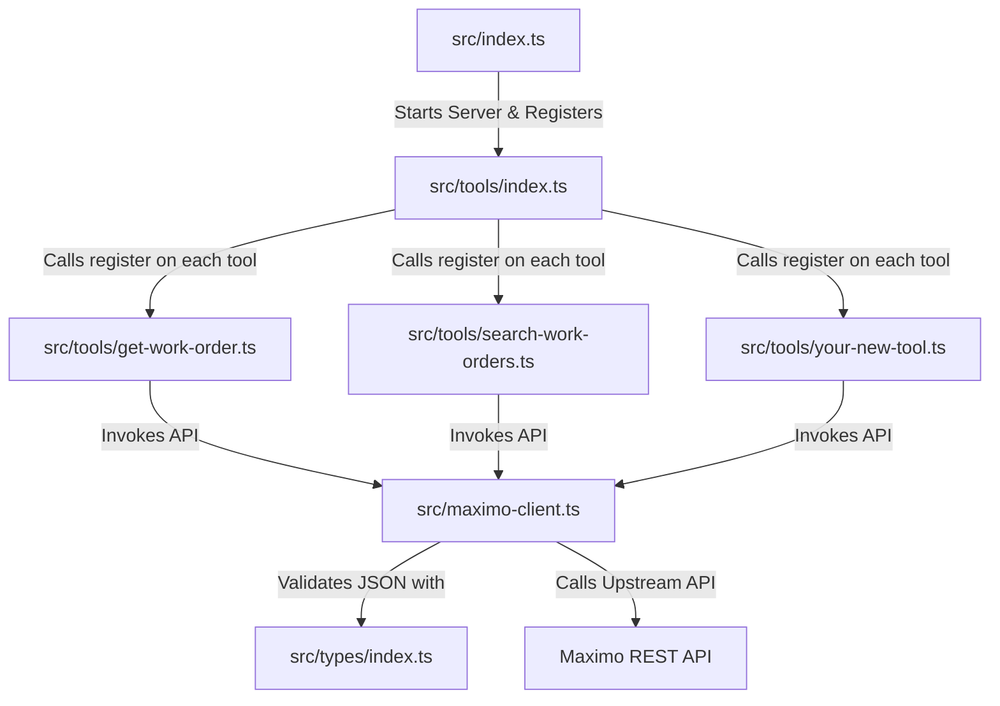

# Guide to Adding New Tools to Maximo MCP Server

This guide describes the modular, registry-based architecture of the Maximo MCP Server and provides a step-by-step workflow for adding new tools.

---

## 🏗️ Architectural Overview

The server uses a highly modular structure to decouple tool definitions, API calling logic, validation schemas, and server startup.



### Key Files
1. **[src/index.ts](file:///d:/OneDrive/BienDong/project/mcp-maximo-080526/src/index.ts)**: Configures the core `McpServer` instance, binds the Streamable HTTP transport, and listens for requests.
2. **[src/tools/index.ts](file:///d:/OneDrive/BienDong/project/mcp-maximo-080526/src/tools/index.ts)**: The tool registry. It exports a single `registerAllTools(server)` function that brings together all separate tool files.
3. **[src/maximo-client.ts](file:///d:/OneDrive/BienDong/project/mcp-maximo-080526/src/maximo-client.ts)**: The central client for calling the Maximo REST API. It handles header authentication (via API keys), Lean mode (`lean=1`), and query formatting.
4. **[src/types/](file:///d:/OneDrive/BienDong/project/mcp-maximo-080526/src/types/)**: Domain-level types and Zod schemas used to validate inputs/outputs.

---

## 🔄 Step-by-Step Flow to Add a New Tool

To illustrate the flow, let's walk through adding a hypothetical tool called `update_work_order_status`.

### Step 1: Locate API Resource Definitions
Refer to the [Maximo REST API Documentation](https://ibm-maximo-dev.github.io/maximo-restapi-documentation/) or [Quick Start Reference](https://maximomastery.com/blog/2026/02/maximo-nextgen-rest-api-a-practical-guide-to-querying-creating-and-integrating/) to identify:
* The target Object Structure (e.g., `MXWODETAIL`).
* The HTTP Method (e.g., `POST` or `PATCH` for updates).
* Necessary headers (e.g., `x-method-override: PATCH` or custom headers for status changes).

For work order status updates in Maximo NextGen REST API, you typically perform a `POST` to the specific work order resource url or modify the parent collection with a specific `x-method-override: PATCH` or by invoking actions.

### Step 2: Define Zod Input & Output Schemas
Define any schemas inside your types directory.

1. **Open [src/types/work-order.ts](file:///d:/OneDrive/BienDong/project/mcp-maximo-080526/src/types/work-order.ts)** (or create a new domain type file if adding completely new models like Assets or Locations).
2. **Add your new schema(s)**:
   ```typescript
   // Input schema for updating work order status
   export const UpdateWorkOrderStatusInputSchema = z.object({
     wonum: z.string().describe("The work order number to update"),
     status: z.enum(WO_STATUS).describe("The new status to apply"),
     siteid: z.string().optional().describe("Site ID (e.g., BD1)"),
     memo: z.string().optional().describe("An optional status change remark/memo"),
   });

   export type UpdateWorkOrderStatusInput = z.infer<typeof UpdateWorkOrderStatusInputSchema>;
   ```
3. **Export them from [src/types/index.ts](file:///d:/OneDrive/BienDong/project/mcp-maximo-080526/src/types/index.ts)**:
   ```typescript
   export {
     SearchWorkOrdersInputSchema,
     WorkOrderSchema,
     WorkOrderCollectionSchema,
     UpdateWorkOrderStatusInputSchema, // Add this
   } from "./work-order.js";
   
   export type {
     SearchWorkOrdersInput,
     WorkOrder,
     WorkOrderCollection,
     UpdateWorkOrderStatusInput, // Add this
   } from "./work-order.js";
   ```

### Step 3: Extend the Maximo Client
Open **[src/maximo-client.ts](file:///d:/OneDrive/BienDong/project/mcp-maximo-080526/src/maximo-client.ts)** and implement a method to make the HTTP call.

```typescript
import type { UpdateWorkOrderStatusInput } from "./types/index.js";

// Add inside maximoClient:
async updateWorkOrderStatus(input: UpdateWorkOrderStatusInput): Promise<any> {
  const { wonum, status, siteid, memo } = input;
  
  // Example implementation: posting a status change action
  // Maximo standard often uses a specialized POST/PATCH with properties
  const url = `/api/os/mxwodetail`;
  
  // Get the target record first or execute a PATCH
  // Assuming a standard PATCH structure:
  const params: Record<string, string> = {
    "oslc.where": `wonum="${wonum}"` + (siteid ? ` and siteid="${siteid}"` : ""),
  };
  
  // Adjust endpoint, headers, and body according to Maximo REST specifications
  // For standard status changes, Maximo has various mechanisms (e.g. actions, or modifying status field directly)
  // Let's assume a PATCH update to status field:
  const targetUrl = new URL(`${config.baseUrl}${url}`);
  targetUrl.searchParams.append("lean", "1");
  Object.entries(params).forEach(([k, v]) => targetUrl.searchParams.append(k, v));

  const response = await fetch(targetUrl.toString(), {
    method: "POST", // Standard Maximo PATCH via POST override
    headers: {
      "apikey": config.apiKey,
      "x-method-override": "PATCH",
      "properties": "wonum,status",
    },
    body: JSON.stringify({
      status,
      statusdesc: memo || "Updated via Maximo MCP Server",
    }),
  });

  if (!response.ok) {
    const errorText = await response.text().catch(() => "Unknown error");
    throw new Error(`Maximo status update failed: ${response.statusText} - ${errorText}`);
  }

  return response.json();
}
```

### Step 4: Create the Tool Registration Module
Create a new file in **[src/tools/](file:///d:/OneDrive/BienDong/project/mcp-maximo-080526/src/tools/)**, e.g., `update-work-order-status.ts`.

```typescript
import { z } from "zod";
import type { McpServer } from "@modelcontextprotocol/sdk/server/mcp.js";
import { maximoClient } from "../maximo-client.js";
import { WO_STATUS } from "../types/work-order.js";

/**
 * Registers the update_work_order_status tool on the MCP server.
 */
export function register(server: McpServer) {
  server.registerTool(
    "update_work_order_status",
    {
      description: "Change the status of a specific Maximo Work Order (e.g., to APPR, INPRG, COMP, or CLOSE).",
      inputSchema: {
        wonum: z.string().describe("The exact Work Order number to update"),
        status: z.enum(WO_STATUS).describe("The new status to transition the Work Order to"),
        siteid: z.string().optional().describe("Optional site ID (e.g. BD1)"),
        memo: z.string().optional().describe("An optional description/memo explaining why the status is being changed"),
      },
    },
    async ({ wonum, status, siteid, memo }) => {
      try {
        const result = await maximoClient.updateWorkOrderStatus({
          wonum,
          status,
          siteid,
          memo,
        });

        return {
          content: [
            {
              type: "text" as const,
              text: `Successfully updated Work Order ${wonum} to status ${status}.\nResponse:\n${JSON.stringify(result, null, 2)}`,
            },
          ],
        };
      } catch (e: any) {
        return {
          isError: true,
          content: [
            {
              type: "text" as const,
              text: `Failed to update status for work order ${wonum}: ${e.message}`,
            },
          ],
        };
      }
    }
  );
}
```

### Step 5: Register the Tool in the Registry Index
Open **[src/tools/index.ts](file:///d:/OneDrive/BienDong/project/mcp-maximo-080526/src/tools/index.ts)** and wire it up:

```typescript
import type { McpServer } from "@modelcontextprotocol/sdk/server/mcp.js";
import { register as registerSearchWorkOrders } from "./search-work-orders.js";
import { register as registerGetWorkOrder } from "./get-work-order.js";
import { register as registerUpdateWorkOrderStatus } from "./update-work-order-status.js"; // 1. Import new tool

export function registerAllTools(server: McpServer): void {
  registerSearchWorkOrders(server);
  registerGetWorkOrder(server);
  registerUpdateWorkOrderStatus(server); // 2. Call registration function

  console.log("[registry] Registered 3 tool(s): search_work_orders, get_work_order, update_work_order_status");
}
```

### Step 6: Validate Your Setup
Compile and run the server to make sure everything type-checks and executes without issues:

```powershell
# Compile the TypeScript files to check for errors
npm run build
```

---

## ⚡ Pro Tips for High-Quality Tools

* **Rich Schema Descriptions**: The `McpServer` exposes schema `.describe()` metadata directly to the LLM. Clear descriptions in your Zod schemas dramatically improve accuracy when Copilot Studio or Claude invokes the tool.
* **Keep Schemas Lean**: Only select fields you actually need inside `oslc.select` to avoid heavy payload transfers and improve execution speed.
* **Informative Responses**: When return results are large or nested, return clean markdown or concise, stringified JSON so the model can read it easily.
* **Graceful Errors**: Always wrap the handler body with a `try/catch` and return `isError: true` so the client understands the request failed instead of crashing the server transport.
