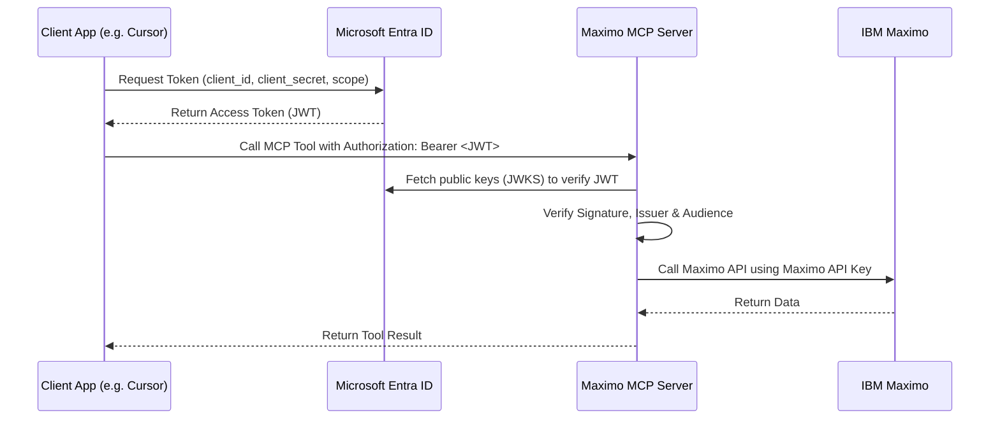

# Azure Entra ID App Registration Guide

This guide details the step-by-step process of registering applications in Microsoft Entra ID (formerly Azure Active Directory) to secure the Maximo MCP Server.

Secure communication is achieved using OAuth 2.0. The MCP Server acts as the **Resource Server (API)** that validates incoming JSON Web Tokens (JWTs), and client applications (e.g. Cursor, Claude, scripts) act as **Clients** that fetch tokens from Microsoft Entra ID.

---

## Architecture Overview



To implement this, you will perform the following steps:

1. **Register the Server App (API)** in your tenant.
2. **Register the Client App** that will request tokens.
3. **Expose an API Scope** on the Server App and grant permission to the Client App.
4. **Obtain key variables** (`AZURE_TENANT_ID`, `AZURE_CLIENT_ID`, and client credentials).
5. **Configure your MCP Server environment**.

---

## Step 1: Register the Server Application (API)

The Server Application represents the Maximo MCP Server itself. It defines the audience and the permissions (scopes) required to access the API.

1. Sign in to the [Azure Portal](https://portal.azure.com).
2. If you have access to multiple tenants, use the **Directories + subscriptions** filter in the top menu to select the tenant in which you want to register the application.
3. Search for and select **Microsoft Entra ID**.
4. In the left navigation pane, select **App registrations** > **New registration**.
5. Configure the registration details:
   - **Name**: Enter a display name, such as `Maximo MCP Server`.
   - **Supported account types**: Select **Accounts in this organizational directory only (Single tenant)**.
   - **Redirect URI**: Leave this blank.
6. Click **Register** at the bottom of the page.
7. Upon successful registration, the portal will display the **Overview** pane. Copy the following values:
   - **Application (client) ID** (This is your server `AZURE_CLIENT_ID`)
   - **Directory (tenant) ID** (This is your `AZURE_TENANT_ID`)

---

## Step 2: Expose the API and Define Scopes

Now, configure the Server App registration to act as a secure API by setting its Application ID URI and defining an access scope.

1. In the Server App registration, select **Expose an API** from the left navigation pane.
2. Next to **Application ID URI**, click **Set**.
   - By default, it will suggest `api://<client-id>`. Keep this value or customize it if necessary.
   - Click **Save**.
3. Click **Add a scope** to create a custom access scope:
   - **Scope name**: `mcp.access`
   - **Who can consent?**: **Admins and users**
   - **Admin consent display name**: `Access Maximo MCP Server`
   - **Admin consent description**: `Allows the application to perform read and write operations via the Maximo MCP Server.`
   - **User consent display name**: `Access Maximo MCP Server`
   - **User consent description**: `Allows the application to perform read and write operations via the Maximo MCP Server.`
   - **State**: **Enabled**
4. Click **Add scope**.
5. Note the full scope path. It will look like: `api://<AZURE_CLIENT_ID>/mcp.access`.

---

## Step 3: Register the Client Application

The Client Application represents the application calling the MCP Server (for example: Cursor IDE, Claude Desktop, or a backend service/script).

1. Go back to **Microsoft Entra ID** > **App registrations** and click **New registration**.
2. Configure the registration details:
   - **Name**: Enter a display name, such as `Maximo MCP Client`.
   - **Supported account types**: Select **Accounts in this organizational directory only (Single tenant)**.
   - **Redirect URI**: Leave this blank.
3. Click **Register**.
4. In the client application's **Overview** pane, copy the **Application (client) ID** for the client application.

---

## Step 4: Create a Client Secret (Client Key)

To authenticate programmatically without user interaction, the client application needs a secret key.

1. In the Client App registration, select **Certificates & secrets** from the left navigation pane.
2. Select the **Client secrets** tab, then click **New client secret**.
3. Configure the secret details:
   - **Description**: e.g., `MCP Server Access Key`
   - **Expires**: Choose a suitable duration (e.g., 180 days / 6 months or custom).
4. Click **Add**.
5. > [!IMPORTANT]
   > **Copy the Secret Value immediately**. Once you navigate away from this screen or refresh the page, the secret value will be permanently masked. You will not be able to retrieve it again. (Copy the **Value** column, NOT the _Secret ID_ column).

---

## Step 5: Grant API Permissions (Consent) to the Client App

Authorize the Client App to request the scope defined on the Server App.

1. In the Client App registration, select **API permissions** from the left navigation pane.
2. Click **Add a permission**.
3. Select the **APIs my organization uses** tab.
4. Search for your server application name (`Maximo MCP Server`) and select it.
5. Choose **Application permissions** or **Delegated permissions** depending on your client scenario:
   - Select **Application permissions** if the client runs in a daemon/automated background mode (e.g., Cursor client-credentials, server-to-server integration).
   - Check the box for `mcp.access`.
6. Click **Add permissions**.
7. > [!IMPORTANT]
   > Under the **Configured permissions** table, click **Grant admin consent for <Tenant Name>** and click **Yes** to confirm. This ensures that client applications can request tokens silently without an interactive prompt.

---

## Step 6: Configure the MCP Server Environment Variables

Now that you have all the IDs and secrets, configure the MCP Server to validate these tokens. Open your `.env` file on the server and update the configuration:

```env
# Enable MS Entra ID verification
AUTH_PROVIDER=entra-id

# Directory (tenant) ID copied from Step 1
AZURE_TENANT_ID=your-azure-tenant-id-here

# Application (client) ID of the Server App copied from Step 1
AZURE_CLIENT_ID=your-server-application-client-id-here

# Audience: The expected 'aud' claim. Must match the Server App's Application ID URI set in Step 2.
# If not defined, it defaults to api://<AZURE_CLIENT_ID>
AZURE_AUDIENCE=api://your-server-application-client-id-here
```

---

## Step 7: How to Obtain and Test Access Tokens

To verify that your configuration works, you can request an access token from Microsoft Entra ID and use it to call the server.

### 1. Request an Access Token via Bash/curl

Run the following command, replacing the placeholder values with your client details:

```bash
curl -X POST https://login.microsoftonline.com/<AZURE_TENANT_ID>/oauth2/v2.0/token \
  -H "Content-Type: application/x-www-form-urlencoded" \
  -d "grant_type=client_credentials" \
  -d "client_id=<CLIENT_APPLICATION_CLIENT_ID>" \
  -d "client_secret=<CLIENT_APPLICATION_CLIENT_SECRET>" \
  -d "scope=api://<SERVER_APPLICATION_CLIENT_ID>/.default"
```

**Response Example:**

```json
{
  "token_type": "Bearer",
  "expires_in": 3599,
  "ext_expires_in": 3599,
  "access_token": "eyJ0eXAiOiJKV..."
}
```

### 2. Request an Access Token via PowerShell

If you are on Windows, you can fetch the token using PowerShell:

```powershell
$tenantId = "<AZURE_TENANT_ID>"
$clientId = "<CLIENT_APPLICATION_CLIENT_ID>"
$clientSecret = "<CLIENT_APPLICATION_CLIENT_SECRET>"
$scope = "api://<SERVER_APPLICATION_CLIENT_ID>/.default"

$body = @{
    grant_type    = "client_credentials"
    client_id     = $clientId
    client_secret = $clientSecret
    scope         = $scope
}

$response = Invoke-RestMethod -Uri "https://login.microsoftonline.com/$tenantId/oauth2/v2.0/token" -Method Post -Body $body -ContentType "application/x-www-form-urlencoded"
$response.access_token
```

### 3. Verify Token with the MCP Server

Once you have the `access_token` string, send an authenticated request to the Maximo MCP Server's `/mcp` endpoint:

```bash
curl -i -X POST https://your-mcp-server-domain.com/mcp \
  -H "Authorization: Bearer <access_token>" \
  -H "Content-Type: application/json" \
  -d '{"jsonrpc": "2.0", "method": "tools/list", "id": 1}'
```

The server should respond with `200 OK` and return the list of tools.

---

## Integrating with Microsoft Copilot Studio

When adding your Maximo MCP Server as a custom tool in **Microsoft Copilot Studio**, you will be prompted to configure OAuth 2.0 authentication. 

Follow these steps to configure Copilot Studio to authenticate against your Entra ID setup:

### Step 1: Configure OAuth 2.0 in Copilot Studio

In the **Add a Model Context Protocol server** wizard in Copilot Studio:
1. Select **OAuth 2.0** as the Authentication method.
2. Select **Manual** as the Type.
3. Fill in the fields using the table below:

| Field Name | Value to Input | Source |
| :--- | :--- | :--- |
| **Client ID** | The **Application (client) ID** of your **Client App Registration** | Step 3 |
| **Client secret** | The **Client Secret Value** (Client Key) of your **Client App Registration** | Step 4 |
| **Authorization URL** | `https://login.microsoftonline.com/<YOUR_AZURE_TENANT_ID>/oauth2/v2.0/authorize` | Step 1 |
| **Token URL template** | `https://login.microsoftonline.com/<YOUR_AZURE_TENANT_ID>/oauth2/v2.0/token` | Step 1 |
| **Refresh URL** | `https://login.microsoftonline.com/<YOUR_AZURE_TENANT_ID>/oauth2/v2.0/token` | Step 1 |
| **Scopes** | `api://<YOUR_SERVER_CLIENT_ID>/mcp.access offline_access` | Step 2 |

> [!NOTE]
> The `offline_access` scope is required so Microsoft Copilot Studio can request refresh tokens and keep the connection active without prompting users to log in repeatedly.

### Step 2: Register the Copilot Studio Redirect URL in Azure

Once Copilot Studio generates the **Redirect URL** (shown at the bottom of the modal):

1. **Copy the Redirect URL** from Copilot Studio.
2. Navigate to the **Azure Portal** > **Microsoft Entra ID** > **App registrations**.
3. Select your **Client App Registration** (e.g., `Maximo MCP Client`).
4. Click **Authentication** in the left navigation menu.
5. Click **Add a platform** and select **Web**.
6. Paste the copied **Redirect URL** into the field.
7. Click **Configure** / **Save**.
8. Go back to Copilot Studio and complete the wizard to save the MCP server.
